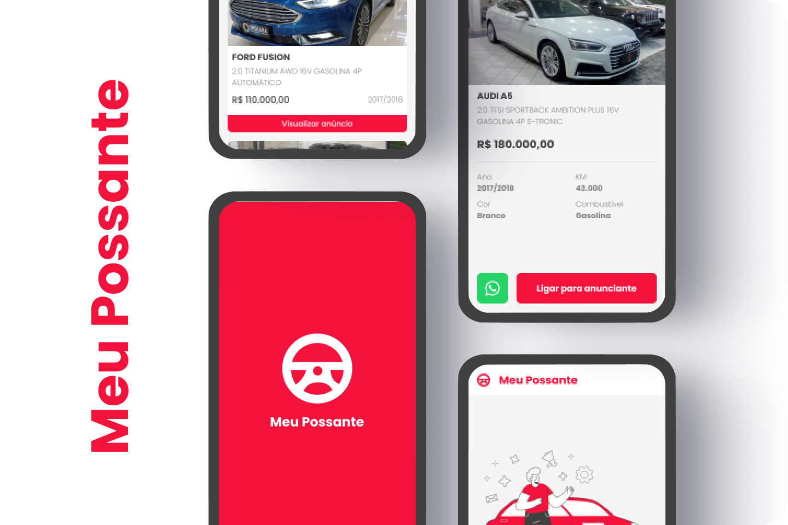

<h1 align="center">
  
</h1>

  <a href="#-projeto">Projeto</a>&nbsp;&nbsp;&nbsp;|&nbsp;&nbsp;&nbsp;
  <a href="#-design">Design</a>

 

  

## ✨ Projeto

Aplicação para anunciar veículos utilizando os dados fornecidos pela [API de Consulta Tabela FIPE](http://fipeapi.appspot.com/).

## 💅🏻 Design

O projeto da interface pode ser visualizado por meio [desse link](https://www.figma.com/file/hnbAQU1ehI77bRBkctFORf/Meu-Possante?node-id=36%3A775).

